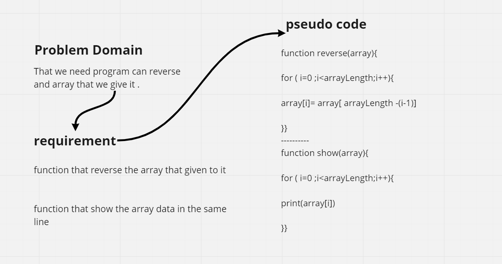

# Reverse an Array

**this program work by Reverse the element in the order.**

## Whiteboard Process

## Approach & Efficiency

separate code to classes and each class have day tasks and every part in the task create function even the show of result so can the code be reusable 
