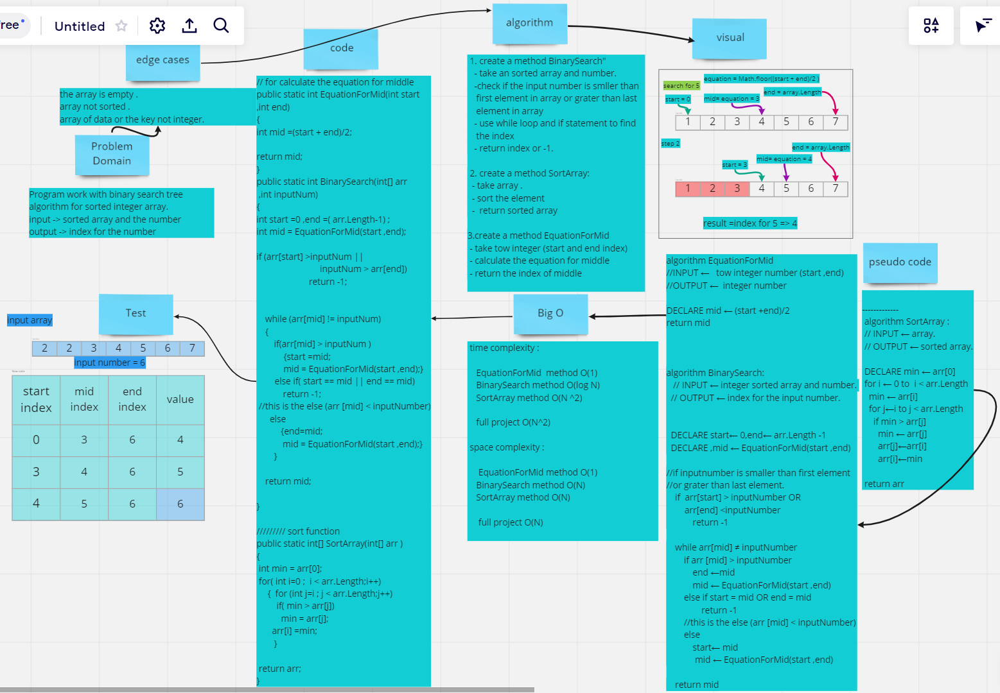

# List Topics

 #|Class|Topic
---|-----|----
1  |Class1|[Reverse an Array](#Reverse-an-Array)
2  |Class2|[Insert to Middle of an Array](#Insert-to-Middle-of-an-Array)
3  |Class3|[Array Binary Search](#Array-Binary-Search)
4  |CLass4|null
5  |Class5|[Singly Linked List](#Singly-Linked-List)


# Reverse an Array

**this program work by Reverse the element in the order.**

## Whiteboard Process


## Approach & Efficiency

separate code to classes and each class have day tasks and every part in the task create function even the show of result so can the code be reusable 


# Insert to Middle of an Array

this challenge take an array and edit it from the middle with the number that given or delete a number
```
 Exampl :
 
  INPUT: [1 ,2 ,3 ,4] ,5

  OUTPUT: [1,2,5,3,4]
          [1 ,2 ,3 ,4]
```
## Whiteboard Process


## Approach & Efficiency
 Separate code to classes and each class so it can reuse it and add more features, and in code i try to find the middle and copy all the content into anther array so i will not have any problem with shifting items


# Array Binary Search


use binary search way to sort integer array .


## Whiteboard Process



## Approach & Efficiency
 Separate code to methods and for main function (BinarySearch) I try to use binary search tree concepts and divide array to half and find the element that user want


# Singly Linked List

## Challenge

this code do some of single linked list prensapels (add to first ,print the list in console and find if elenemt is exist)


## Approach & Efficiency

linked list alogrithem and the big(O) 
- for add is O(1)
- for print O(n)
- for Indicates O(n)


## API 
- Insert
 in this method we will add elemint at the head of lest and make the previos head the second elemint in list


-  Tostring 

in this method print the list element in console .


- Indicates
 find if elenemt is exist 


