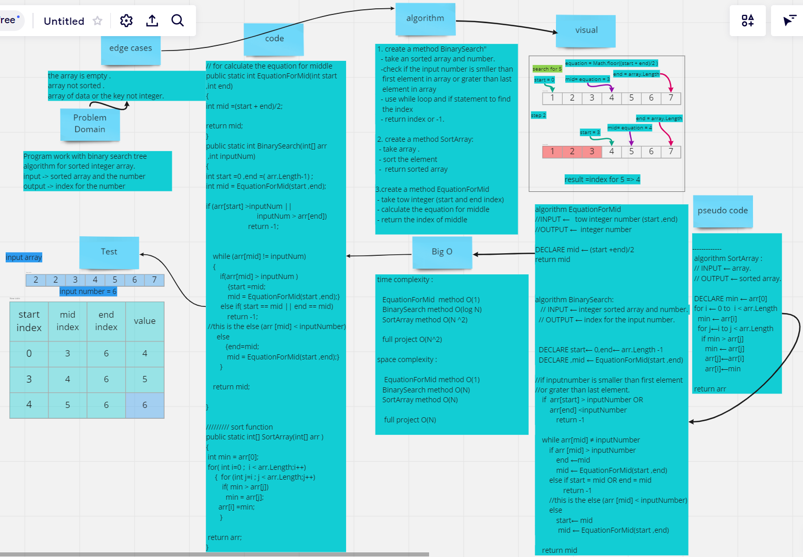

# Array Binary Search

use binary search way to sort integer array .

---

## Whiteboard Process

-----

## Approach & Efficiency
 Separate code to methods and for main function (BinarySearch) I try to use binary search tree concepts and divide array to half and find the element that user want
