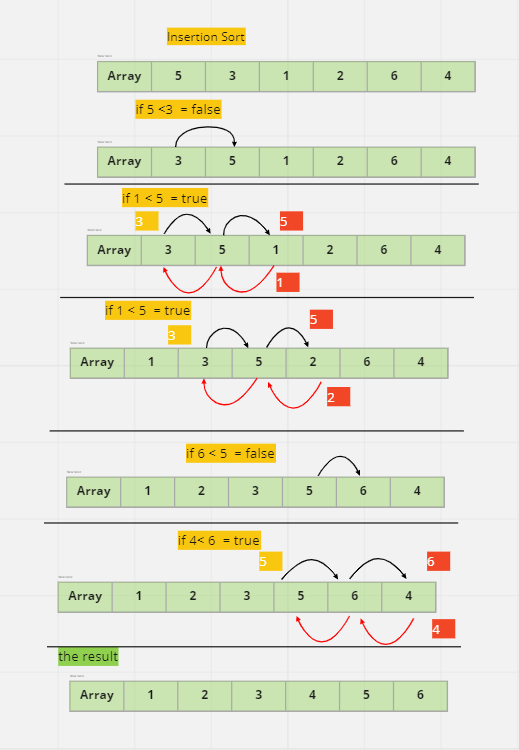

# Challenge Summary
code use  Insertion Sort algorithm 
## Whiteboard Process

## Approach & Efficiency
i use the Insertion Sort algorithm to create functions that work as it is

- time complexity: O(n^2)
- space complexity:O(1)

## Solution
**RUN**

----
**TEST**

