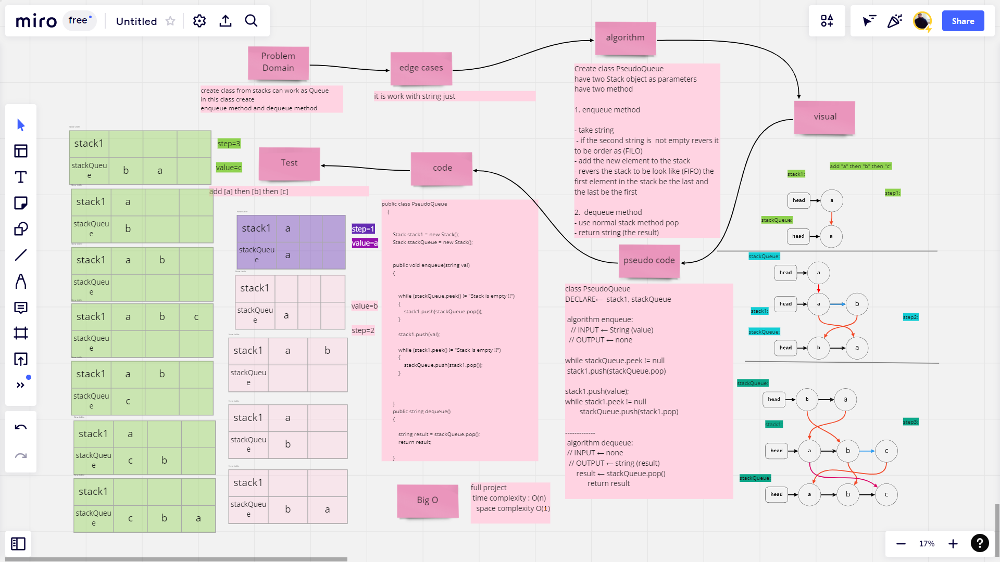
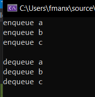
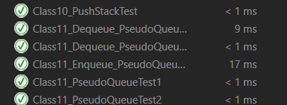

# Challenge Summary
create class from stacks can work as Queue
in this class create 
1. enqueue method
2. dequeue method
 
## Whiteboard Process

## Approach & Efficiency

try to reduce the code and work more on our previous class stack.
 
## Solution
- Running Console

- Test Unite

