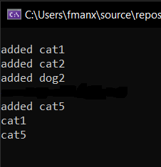

# Challenge Summary :file_folder:
create Queue that take just cat and dog as animals object.

## Whiteboard Process  :notebook:

## Approach & Efficiency :envelope:
using the Queue class methods and eidt it as the requerment to accepted Cat and Dog object just 
## Solution :beetle:

## TEST :notebook:

