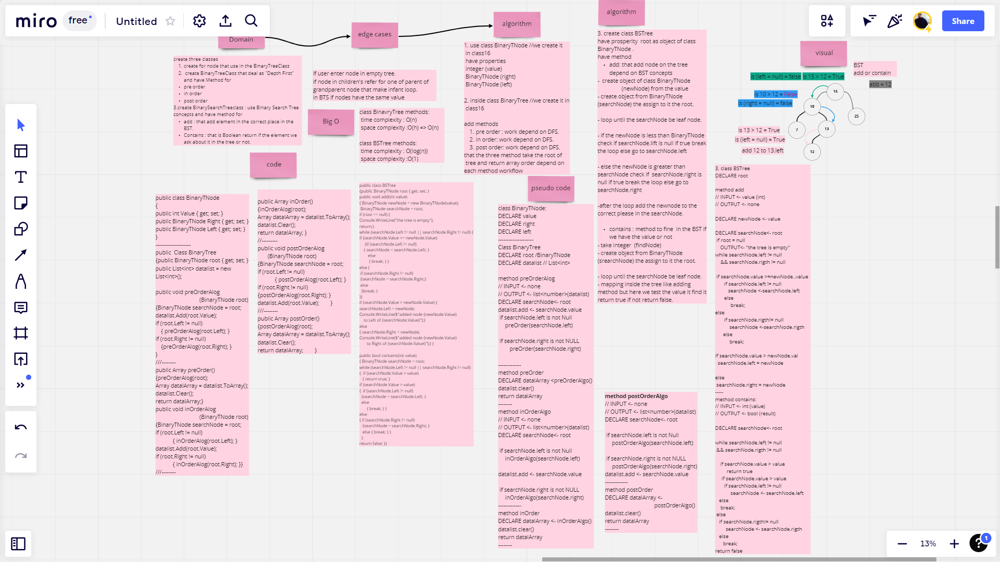
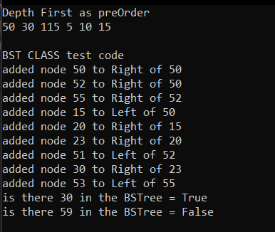
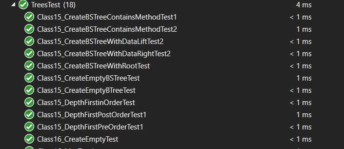

# Trees 
Create classes for Trees 
1. Create BinaryTree Class that deals as "Depth First" and have Methods for
    - pre order.
    - in order.
    - post order.
2. Create BSTree class that work depending on Binary Search Tree Concepts, and have methods
    - add: that add element in the correct place in the BST.
    - Contains: that is Boolean return if the element we ask about it in the tree or not.

## Challenge

-----   
## Approach & Efficiency

using the algorithm for trees to create classes work on it with the best performance

-----
## API
you can use class for tree `BinaryTree` and `BSTree` like create an object from `List<>`
In the same way you have to create an object and from this object you can tap `.` then you will find the method that exist and the name is so clear to understand what the method do like `.add()` to add note ...etc.

-----
## Run 

-----
## Test

