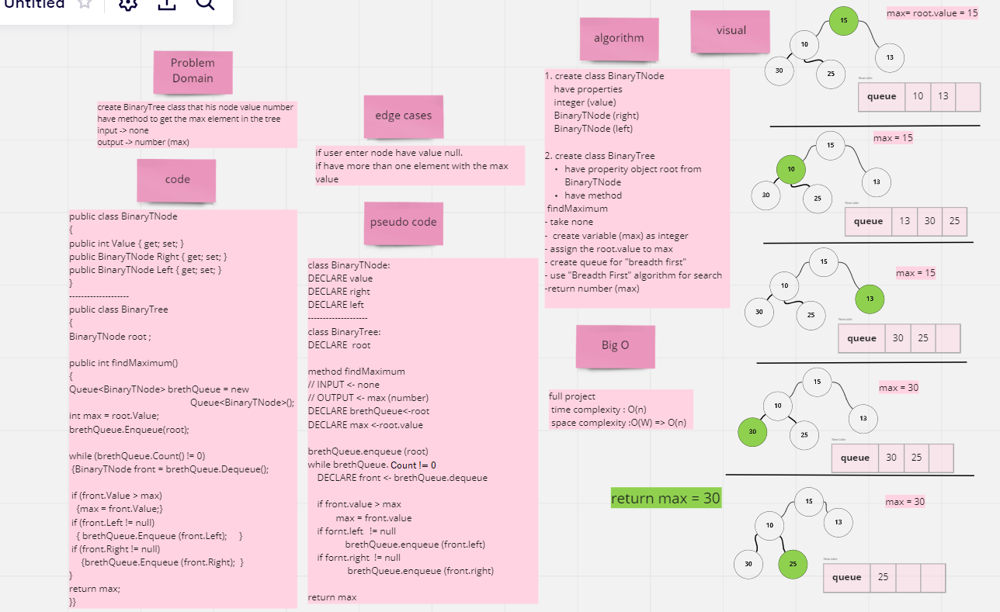
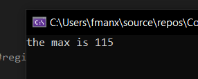

# Challenge Summary

Create BinaryTree class that his node value number have method to get the `max Element` in the tree.

## Whiteboard Process
---

## Approach & Efficiency
---
try to ues best complexity in this project and make the code general and reusable.

## Solution
---

## Test
---

## Tree DATA
---

