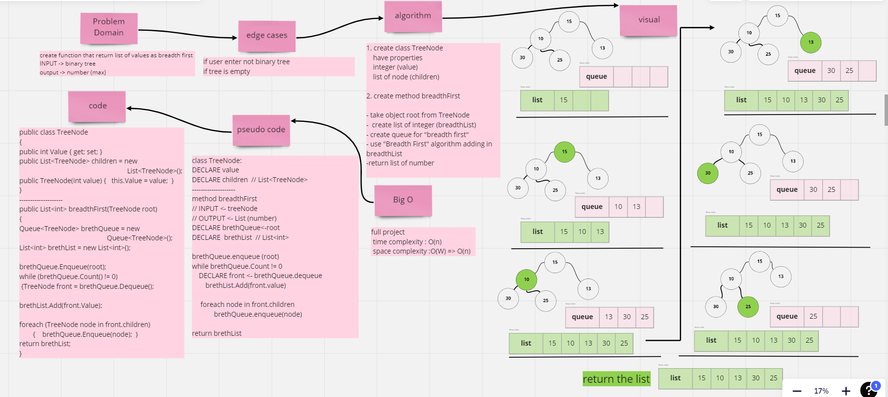
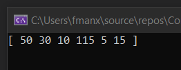
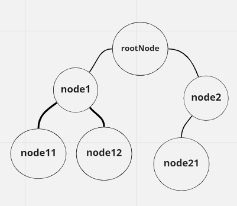

# Challenge Summary

create function that return list of values as `breadth first`.

## Whiteboard Process

## Approach & Efficiency
ues best complexity for `breadth first` and make the method work in the tree that is not just binary.

## Solution

## Test

## Tree DATA

