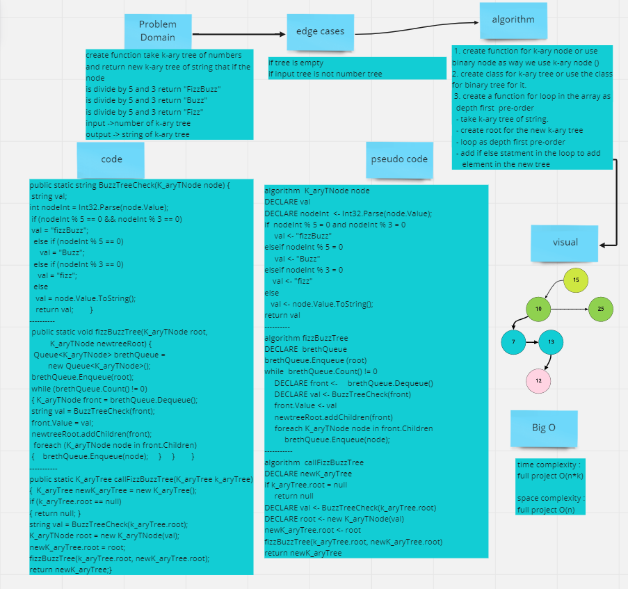

# Challenge Summary
create function take k-ary tree of numbers and return new k-ary tree of string that if the node
is divide by 5 and 3 return "FizzBuzz"
is divide by 5 and 3 return "Buzz"
is divide by 5 and 3 return "Fizz"
## Whiteboard Process

## Approach & Efficiency
try to use the previos class to reduse code 

time complexity : full project O(n*k)

space complexity : full project O(n)
## Solution

## test 

