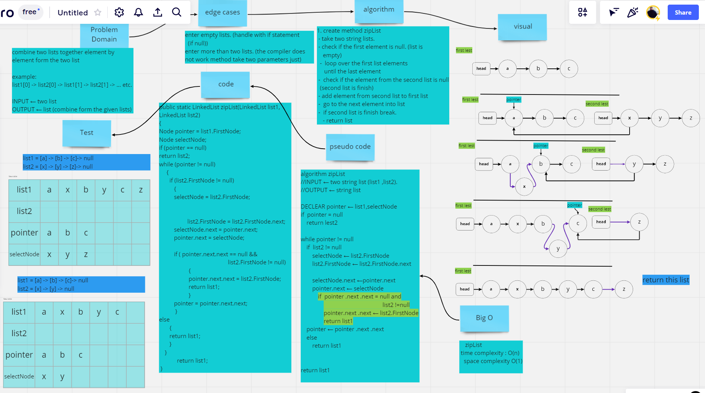
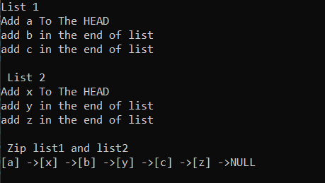
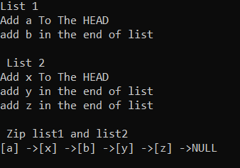
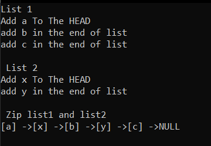
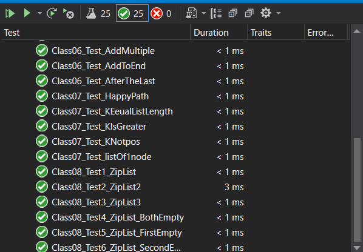

# Challenge Summary

Combine two lists together element by element form the two list to one list.

## Whiteboard Process

---

## Approach & Efficiency

---

try to reduce space and time complexity as much as can and deal with the most possible error without exceptions
## Solution

---

**Combine two list with the same length**  

  

**Combine two list with first list is greater than the second list**  
  

**Combine two list with second list is greater than the first list**  
  

**Test Unit**
      