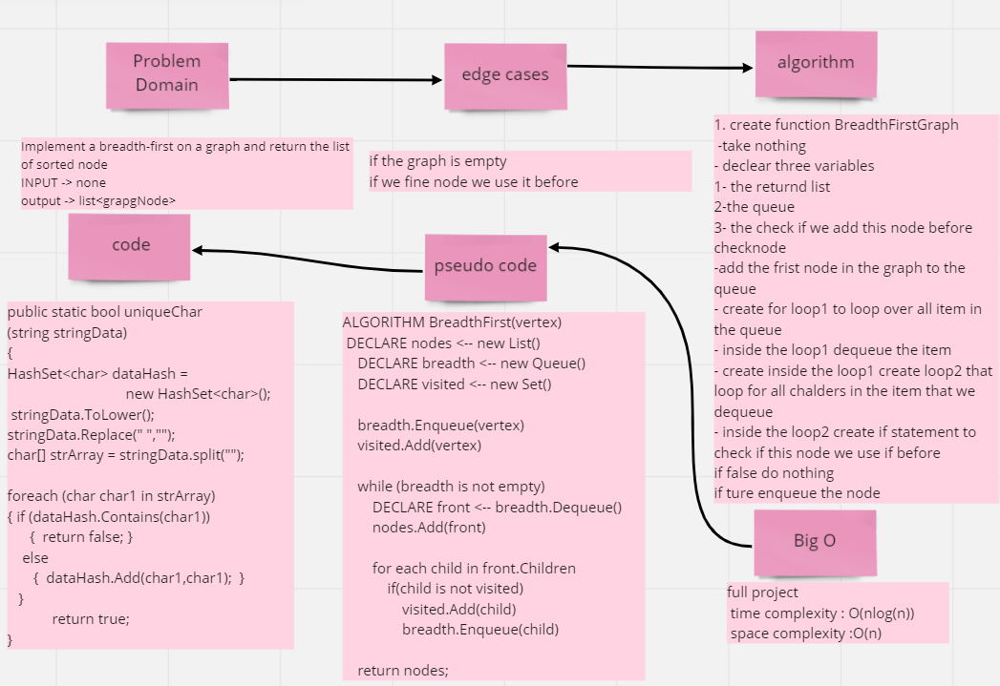
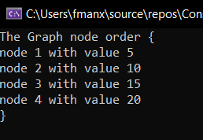

## Challenge
Implement a breadth-first on a graph and return the list of sorted node
-----   
## Whiteboard Process

## Approach & Efficiency

using the algorithm for create breadth-first on a graph work on it to return the result as array with the best performance

**time complexity : O(nlog(n))**  
**space complexity :O(n)**

-----
## Solution
-----
## Run 

-----
## Test

