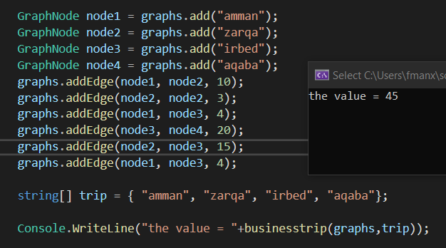

## Challenge
Create function that test if there is an edge between two selected node and the Weight of the edge if exist
//INPUT: graph of string /array of string
//OUTPUT:decimal

-----   

## Whiteboard Process

## Approach & Efficiency

**time complexity : O((n^2))**  
**space complexity :O(1)**

-----
## Solution
-----
## Run 

-----
## Test

