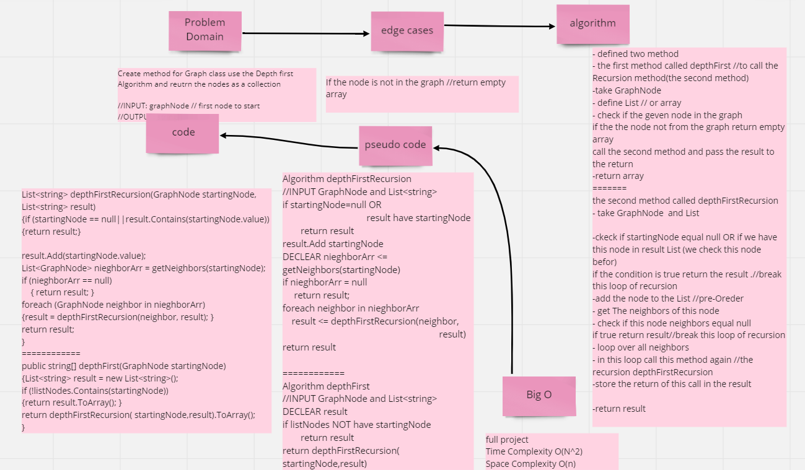
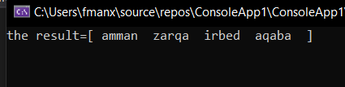
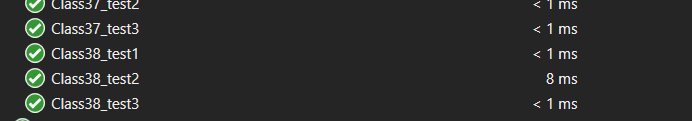

## Challenge
Create method for Graph class use the Depth first Algorithm and reutrn the nodes as a collection

-----   

## Whiteboard Process

## Approach & Efficiency

**time complexity : O((n^2))**  
**space complexity :O(n)**

-----
## Solution
-----
## Run 

-----
## Test

## Requirements

1. [unit tests](../../TestProject1/GraphsTest.cs)
2. [Challenge_Submission](../../ConsoleApp1/CodeChallenge/Graphs/Graphs.cs)
