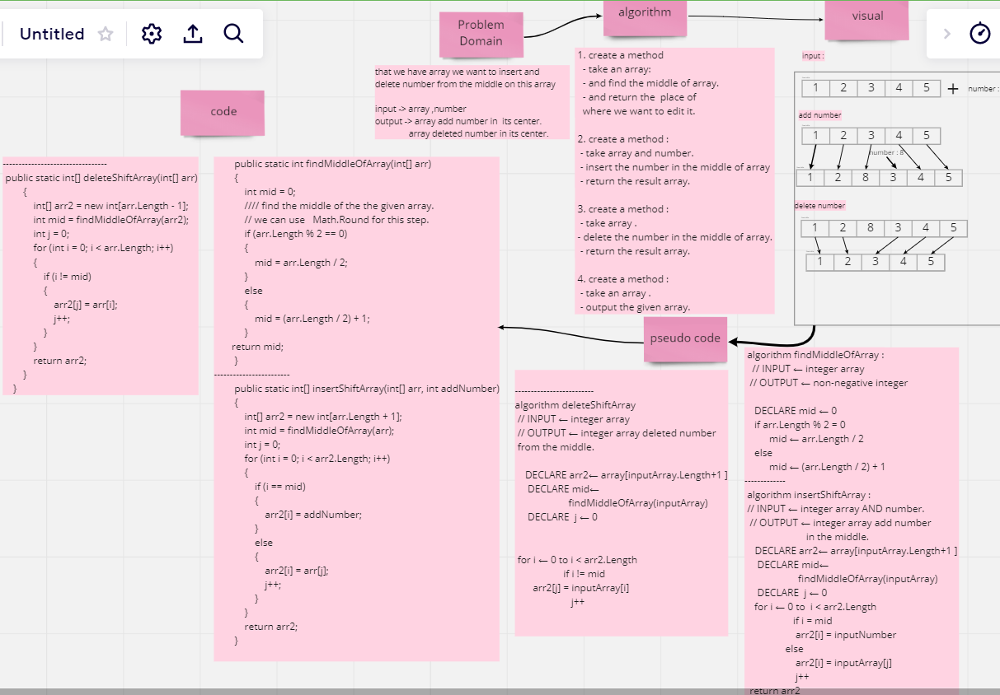

# insert to Middle of an Array

this challenge take an array and edit it from the middle with the number that given or delete a number
```
 Exampl :
 
  INPUT: [1 ,2 ,3 ,4] ,5

  OUTPUT: [1,2,5,3,4]
          [1 ,2 ,3 ,4]
```

----


## Whiteboard Process



----


## Approach & Efficiency
 Separate code to classes and each class so it can reuse it and add more features, and in code i try to find the middle and copy all the content into anther array so i will not have any problem with shifting items

