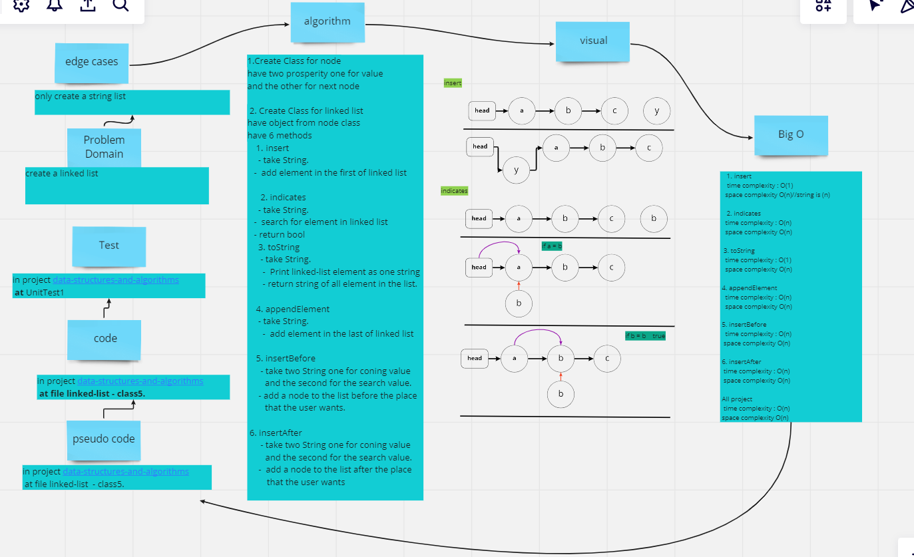
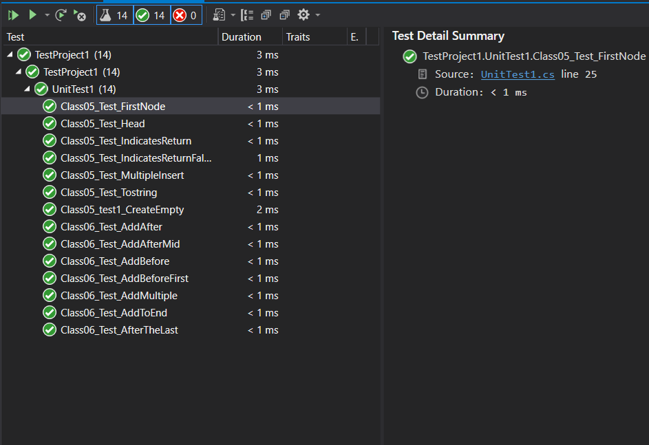

# Linked List insertions

in this code we add more features to your linked list code that give us more control where to add the element(insertAfter,insertBefore,addToEnd)

---

## Whiteboard Process

 

---
## Approach & Efficiency

linked list alogrithem and the big(O) 

- for appendElement O(n)
- for insertAfter O(n)
- for insertBefore O(n)
- for all alogrithem O(n)

1. insertAfter  
add node to the list `after` the palace that user want.

2. insertBefore  
add node to the list `before` the palace that user want.

3. appendElement  
in this method we will add elemint at the `end` of lest 

## Solution

----

**Class6 Output**  

  

---

**Class6 test**  
 

