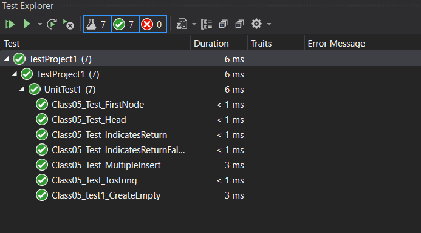

# Singly Linked List

this code do some of single linked list prensapels but i will created it with my code logic.

## Challenge

this code do adding to first ,print the list in console and find if elenemt is exist or Not.

## Approach & Efficiency

---

linked list alogrithem and the big(O) 
- for add (insert) is O(1)
- for print (toString) O(n)
- for indicates (indicates) O(n)
- for all alogrithem O(n)

## API

----

1.insert  
 in this method we will add elemint at the head of lest and make the previos head the second elemint in list

2.toString 

in this method print the list element in console .

3.indicates  
 find if elenemt is exist in the list

4. getHead  
 Check and get the place of head

## Solution

---

**Class5 Output**  

   

----

**Class5 test**  

  

