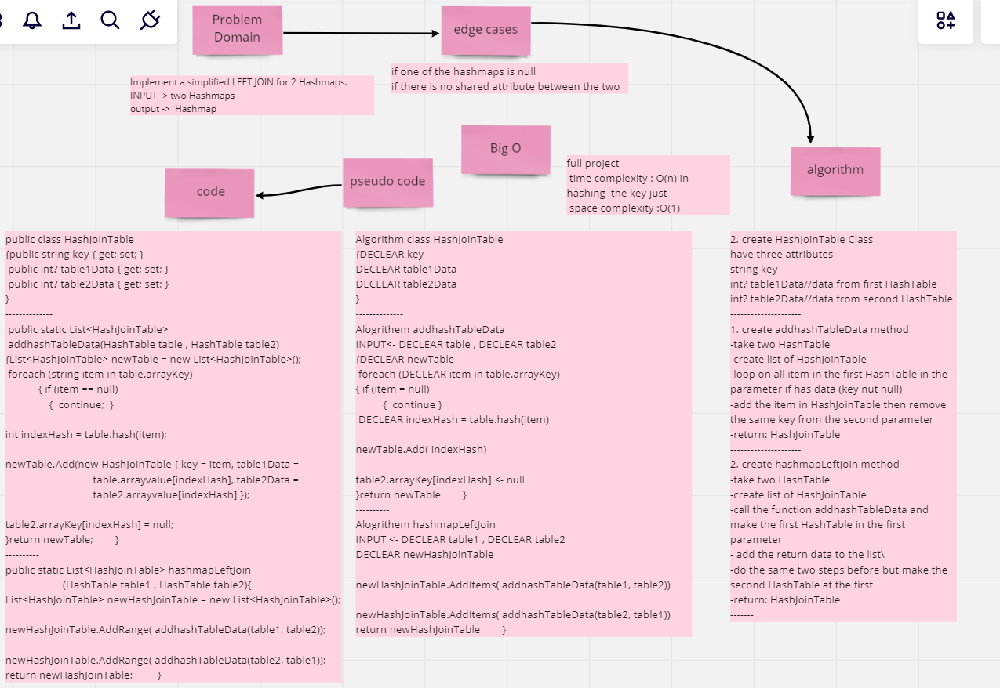

# Hashmap LEFT JOIN
Implement a simplified LEFT JOIN for 2 Hashmaps.
## Whiteboard Process

## Approach & Efficiency

- time complexity: O(n) 
- space complexity:O(1)

## Solution
**RUN**

----
**TEST**

