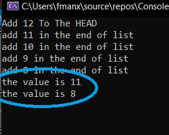

# Challenge Summary

Add more method for our linked class, add method to get elemenet that user select his node number depend that nodes number start from 0. 

## Whiteboard Process

## Approach & Efficiency

I take the less time complexity try to do less loops to get best time complexity O(n)

## Solution

**Console RUN**

**TESTS**

