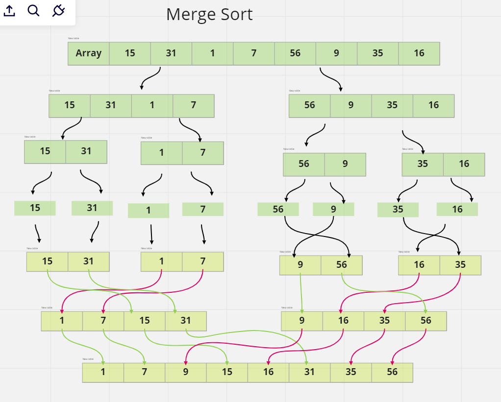

# Challenge Summary
code use  Merge Sort algorithm 
## Whiteboard Process

## Approach & Efficiency
i use the Merge Sort algorithm to create functions that work as it is

- time complexity: O(n Log n)
- space complexity:O(n)

## Solution
**RUN**

----
**TEST**

