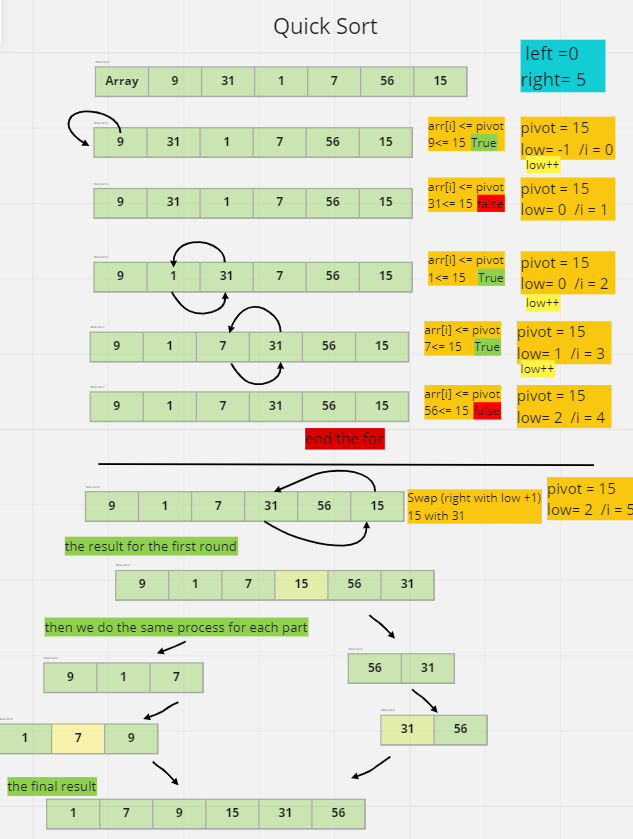
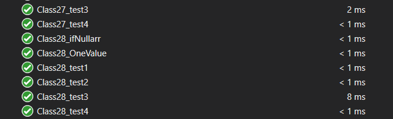

# Challenge Summary
code use  Quick Sort algorithm 
## Whiteboard Process

## Approach & Efficiency
i use the Quick Sort algorithm to create functions that work as it is

- time complexity: `O(n Log n)` when the way to choose the pivot is correct but in general we call it `O(n^2)` 
- space complexity:`O(n)`

## Solution
**RUN**

----
**TEST**

