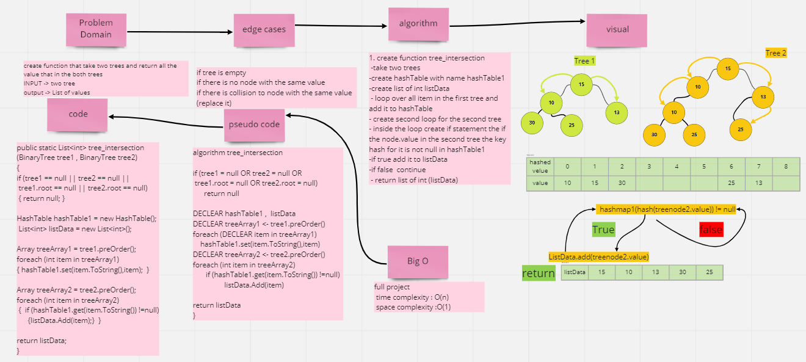
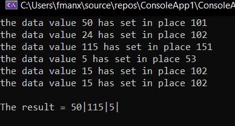
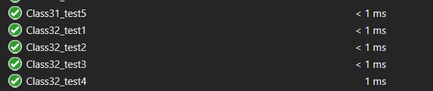

# Challenge Summary
create function that take two trees and return all the value that in the both trees 
## Whiteboard Process

## Approach & Efficiency

- time complexity: O((n) 
- space complexity:O(n)

## Solution
**RUN**

----
**TEST**

